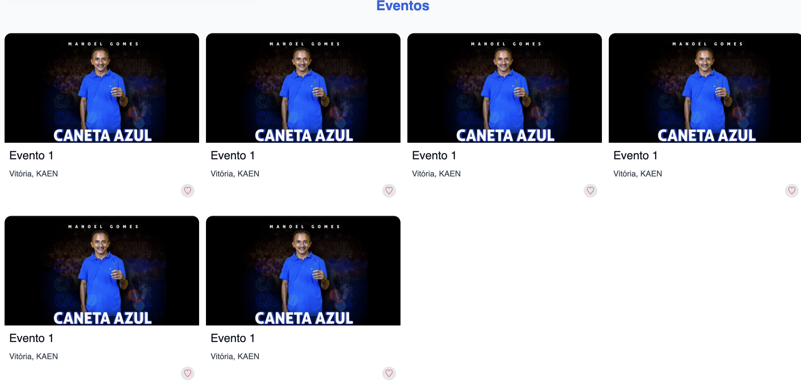

# Random react stuff

### Using this I'm currently using this repo as a place to dump some Reactjs exercises.

### User card component:

A simple user card component that displays the user avatar, name and email. It also contains a button to trigger the details view.

### Event grid component:

A simple grid component that displays a list of upcoming events in your area (yea sure lol).

